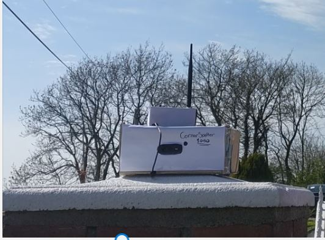
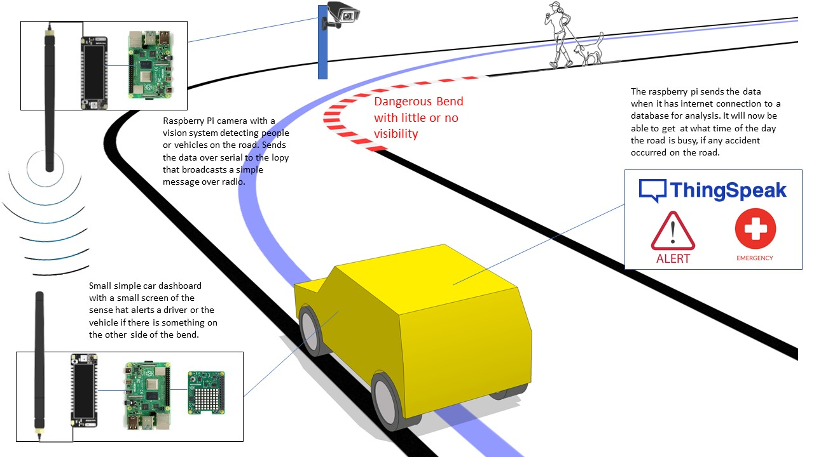
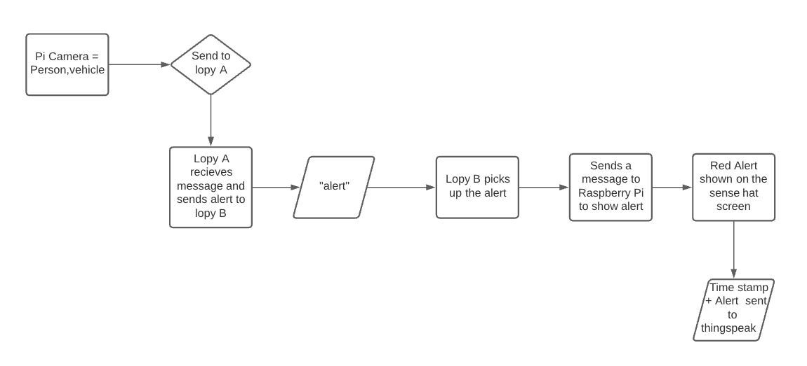
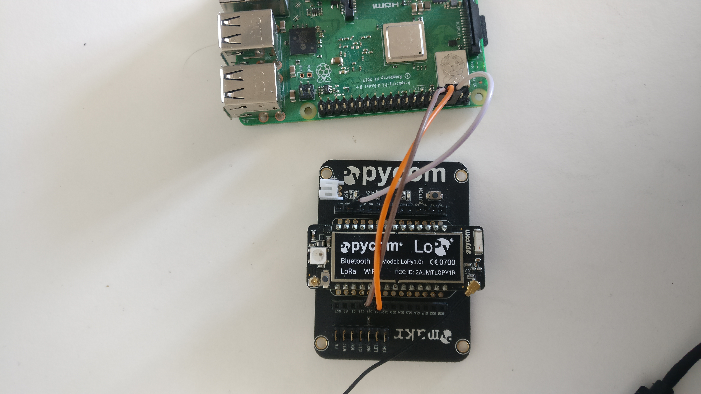
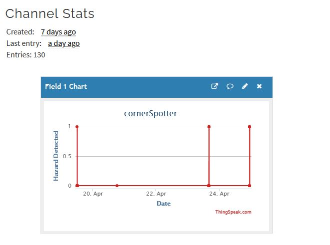
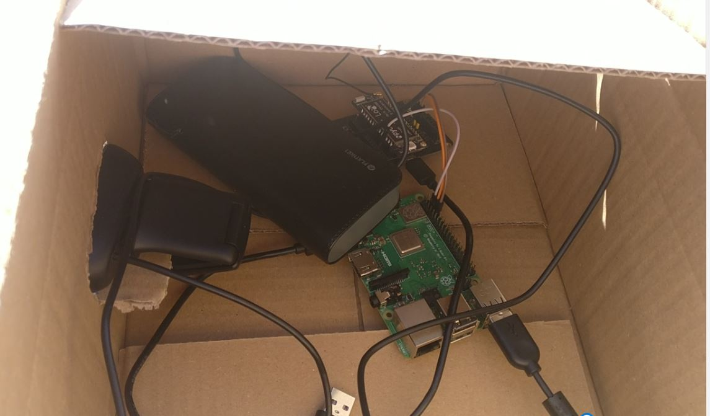
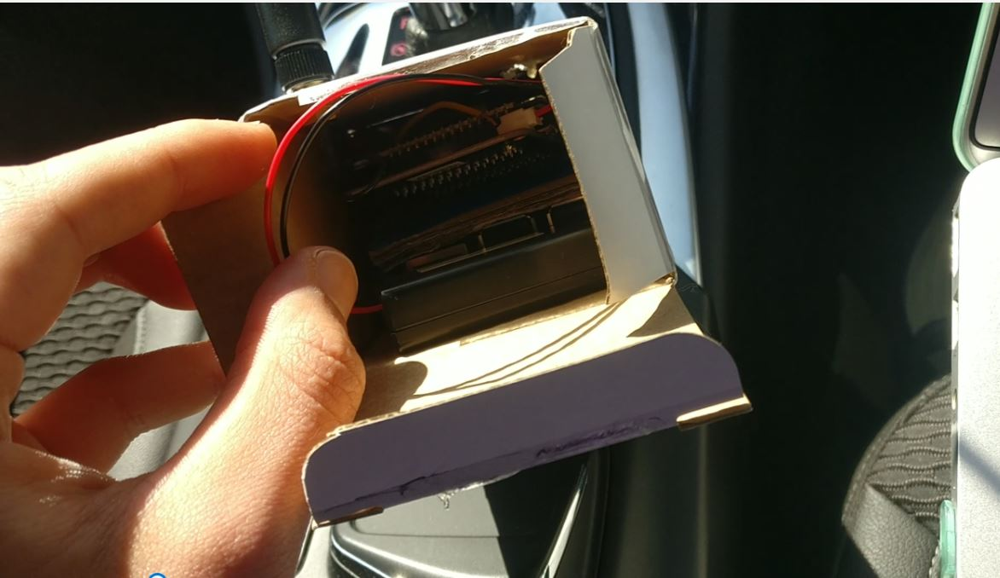
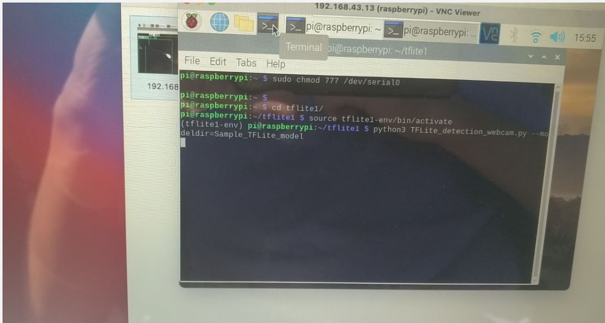
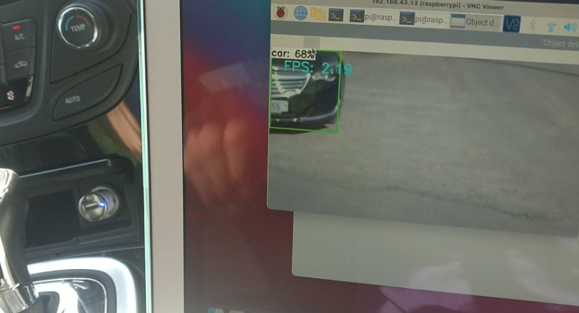

# cornerSpotter


[]

### Index
* My initial plan
* Project Graphics
* How to
* Common Errors
* References 

### In a nutshell:
Internet of things warning system for vehicles when travelling around tight corners.

## My initial plan:
The project vision is that a beacon situated on a tight corner will be able to warn a driver or a self driving vehicle about an oncoming obstacle if one exists.
The beacon will be equipped with its vision system and will be able to communicate with a oncoming vehicle that is in a way subscribed to an application.

The application inside the vehicle is assumed to have internet connection most of the time therefore all the data the car receives from the beacon will be transmitted into the cloud where more analysis and decisions can be made.

The beacons and the application receivers inside the car must be scalable that it could pick up messages from each other without any major configurations.

## The technology that I used.
* Two raspberry pis for communication.
* Usb web camera used for the vision system.
* 2 lopy modules.
* Tensor flow lite for object recognition.
* thingSpeak  platform to send the data to the web.

## Project Graphics

#### Flow chart


# How to make this project 

### Step 1 Setting up the lopy
* First try to test the lopys if they work, the first thing that you will need to probably do is update them [here.](https://pycom.io/downloads/ "Lopy update")  Its a updated app that you will need to follow some steps depending on the version of lopy that is used.

    
     Having the lopys up to date make sure the antennas are plugged in and try to do this [tutorial](https://docs.pycom.io/tutorials/networks/lora/module-module/).

    Once the tutorial i sucessful the 2 modified files in **Lopy A and Lopy B** can now be uploaded to the lopys.

### Step 2 Setting up the vision system
* Big thanks to [EdjeElectronics](https://github.com/EdjeElectronics) for his guide on setting up tensor flow lite. The best thing to do would be to follow his [instructions](https://www.youtube.com/watch?v=aimSGOAUI8Y&t=166s) and then replace the file webcam.py with my [modified](./RaspberryPiVision) file that contains serial communication and outputs to command line.

### Step 3 Serial connections

* To connect the 2 lopys and the raspberry pis in serial like so :
 Connect the RPi (pins TX:14, RX:15) via UART to the LoPy using the expansion board (pins TX:G11, RX:G24) also connect the ground pins together. 

### Step 4 Connect to thingSpeak

* First make a [thingSpeak](https://thingspeak.com/) account.
  Make a Channel with only one variable that is detected. 
    

    Once the channel is made on the other raspberry pi not running the vision system copy the file in the [RaspberryPiCar](./RaspberryPiCar) folder. Remember to use your own write key API.


### Step 5 Running the project
* Test this firs at a desk to check everything is working before testing this in the real world.

   Make sure the devices are properly connected in serial and power them on , run the tensor flow lite with webcam detection script on one pi and the thingspeak script on the other. If you are accessing the pi with the vision system remotely it would be useful to use a vnc viewer to see whats going on and to avoid errors.  


   Show yourself or a toy car in the camera and see that the lopy connected to the vision system should blink either green or blue and the receiving lopy should how a red LED once a hazard is detected.







# Common Errors

* With my experience and running the project I had a unfortunate hardware issue where the antenna didn't work 100%  and had to be pressed down. This can be checked by running the test in step 1.

* Another issue can be the serial permissions on the raspberry pi to fix this run this command: 
```
sudo chmod 777 /dev/serial0
```

* An error like "ImportError: No module named 'cv2'" when running the tensorflow script can occur, this means that you are not in the virtual environment to fix this run this command : 

```
cd tflite1
source tflite1-env/bin/activate
```

## References
Big thanks  to [Edje Electronics](https://github.com/EdjeElectronics/TensorFlow-Lite-Object-Detection-on-Android-and-Raspberry-Pi/blob/master/Raspberry_Pi_Guide.md) on their guide on setting up tensorflow 

Also big thanks to Alex Bucknall and his guide on [serial connection](https://github.com/Bucknalla/lopy-raspberrypi). 

Huge thanks to my lecturer for his support.


